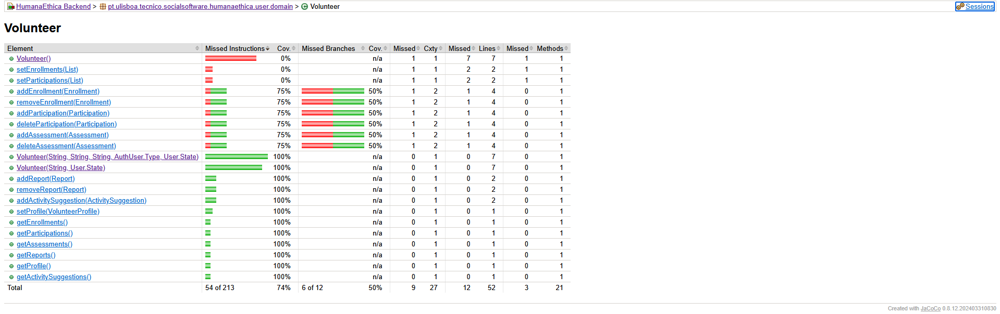

# ES P1 submission, Group 61

## Feature 1 - Activity Suggestion

### Subgroup
 - João Pinho, 102765, [GitLab link](https://gitlab.rnl.tecnico.ulisboa.pt/ist1102765)
   + Issues assigned: [#7](https://gitlab.rnl.tecnico.ulisboa.pt/es/es25-61/-/issues/7), [#31](https://gitlab.rnl.tecnico.ulisboa.pt/es/es25-61/-/issues/31), [#26](https://gitlab.rnl.tecnico.ulisboa.pt/es/es25-61/-/issues/26), [#27](https://gitlab.rnl.tecnico.ulisboa.pt/es/es25-61/-/issues/27), [#28](https://gitlab.rnl.tecnico.ulisboa.pt/es/es25-61/-/issues/28)
 - Pedro Silveira, 106642, [GitLab link](https://gitlab.rnl.tecnico.ulisboa.pt/ist1106642)
   + Issues assigned: [#8](https://gitlab.rnl.tecnico.ulisboa.pt/es/es25-61/-/issues/8), [#30](https://gitlab.rnl.tecnico.ulisboa.pt/es/es25-61/-/issues/30), [#25](https://gitlab.rnl.tecnico.ulisboa.pt/es/es25-61/-/issues/25), [#29](https://gitlab.rnl.tecnico.ulisboa.pt/es/es25-61/-/issues/29), [#32](https://gitlab.rnl.tecnico.ulisboa.pt/es/es25-61/-/issues/32)
 
### Merge requests associated with this feature

The list of pull requests associated with this feature is:

 - [MR !3 - Full feature to master](https://gitlab.rnl.tecnico.ulisboa.pt/es/es25-61/-/merge_requests/3)

### Test Coverage Screenshot

#### Relevant Added Entities
  - `suggestion.domain.ActivitySuggestion` 
  - `suggestion.dto.ActivitySuggestionDto` 
  - `suggestion.ActivitySuggestionService` 
  - `suggestion.ActivitySuggestionController` 

#### Relevant Changed Entities
  - `user.domain.Volunteer` 
  - `institution.domain.Institution` 

---

## Feature 2 - Volunteer Profile

### Subgroup
 - Rodrigo Freire, ist106485, [GitLab link](https://gitlab.rnl.tecnico.ulisboa.pt/ist1106485)
   + Issues assigned: [#45](https://gitlab.rnl.tecnico.ulisboa.pt/es/es25-61/-/issues/45), [#51](https://gitlab.rnl.tecnico.ulisboa.pt/es/es25-61/-/issues/45), [#52](https://gitlab.rnl.tecnico.ulisboa.pt/es/es25-61/-/issues/52), [#53](https://gitlab.rnl.tecnico.ulisboa.pt/es/es25-61/-/issues/53)
 - Isabel Comédias, ist102074, [GitLab link](https://gitlab.rnl.tecnico.ulisboa.pt/ist1102074)
   + Issues assigned: [#46](https://gitlab.rnl.tecnico.ulisboa.pt/es/es25-61/-/issues/46), [#47](https://gitlab.rnl.tecnico.ulisboa.pt/es/es25-61/-/issues/47), [#48](https://gitlab.rnl.tecnico.ulisboa.pt/es/es25-61/-/issues/48), [#49](https://gitlab.rnl.tecnico.ulisboa.pt/es/es25-61/-/issues/49), [#50](https://gitlab.rnl.tecnico.ulisboa.pt/es/es25-61/-/issues/50)
 
### Merge requests associated with this feature

The list of pull requests associated with this feature is:

 - [MR !1 - Intermediate branch with full feature](https://gitlab.rnl.tecnico.ulisboa.pt/es/es25-61/-/merge_requests/1)
 - [MR !2 - Full feature to master](https://gitlab.rnl.tecnico.ulisboa.pt/es/es25-61/-/merge_requests/2)

### Test Coverage Screenshot

#### Relevant Added Entities
  - `user.domain.VolunteerProfile` 
  - `user.dto.VolunteerProfileDto` 
  - `user.UserProfileService` 
  - `user.UserProfileController` 

#### Relevant Changed Entities
  - `user.domain.Volunteer` 
    - `getProfile()`
    - `setProfile()`
  - `participation.domain.Participation` 
    - `setVolunteerProfile()`

---

## Feature 3 - Institution Profile

### Subgroup
 - Beatriz Martinho, ist1106835, [GitLab link](https://gitlab.rnl.tecnico.ulisboa.pt/ist1106835)
   + Issues assigned: [#40](https://gitlab.rnl.tecnico.ulisboa.pt/es/es25-61/-/issues/40), [#42](https://gitlab.rnl.tecnico.ulisboa.pt/es/es25-61/-/issues/42), [#36](https://gitlab.rnl.tecnico.ulisboa.pt/es/es25-61/-/issues/36), [#38](https://gitlab.rnl.tecnico.ulisboa.pt/es/es25-61/-/issues/38), [#39](https://gitlab.rnl.tecnico.ulisboa.pt/es/es25-61/-/issues/39), [#15](https://gitlab.rnl.tecnico.ulisboa.pt/es/es25-61/-/issues/15)
 - Irell Zane, ist1107161, [GitLab link](https://gitlab.rnl.tecnico.ulisboa.pt/ist1107161)
   + Issues assigned: [#34](https://gitlab.rnl.tecnico.ulisboa.pt/es/es25-61/-/issues/34), [#35](https://gitlab.rnl.tecnico.ulisboa.pt/es/es25-61/-/issues/35), [#37](https://gitlab.rnl.tecnico.ulisboa.pt/es/es25-61/-/issues/37), [#54](https://gitlab.rnl.tecnico.ulisboa.pt/es/es25-61/-/issues/54), [#33](https://gitlab.rnl.tecnico.ulisboa.pt/es/es25-61/-/issues/33), [#41](https://gitlab.rnl.tecnico.ulisboa.pt/es/es25-61/-/issues/41), [#16](https://gitlab.rnl.tecnico.ulisboa.pt/es/es25-61/-/issues/16)
 
### Merge requests associated with this feature

The list of pull requests associated with this feature is:

 - - [MR !4 - Full feature to master](https://gitlab.rnl.tecnico.ulisboa.pt/es/es25-61/-/merge_requests/4)

### Test Coverage Screenshot

#### Relevant Added Entities
  - `institution.InstitutionProfileController` 
  - `institution.InstitutionProfileService` 
  - `institution.dto.InstitutionProfileDto` 
  - `institution.domain.InstitutionProfile` 

#### Relevant Changed Entities
  - `activity.ActivityService` 
  - `assessment.AssessmentService` 
  - `institution.domain.Institution` 
  - `participation.ParticipationController` 
  - `participation.ParticipationService` 
  - `user.UserService` 